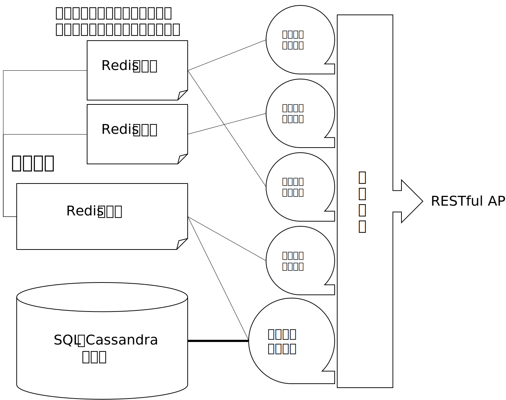
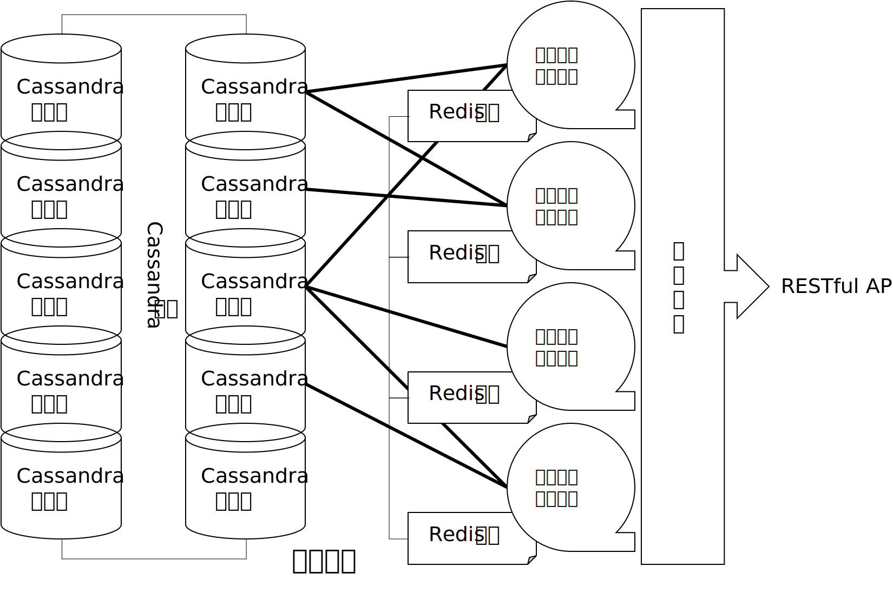
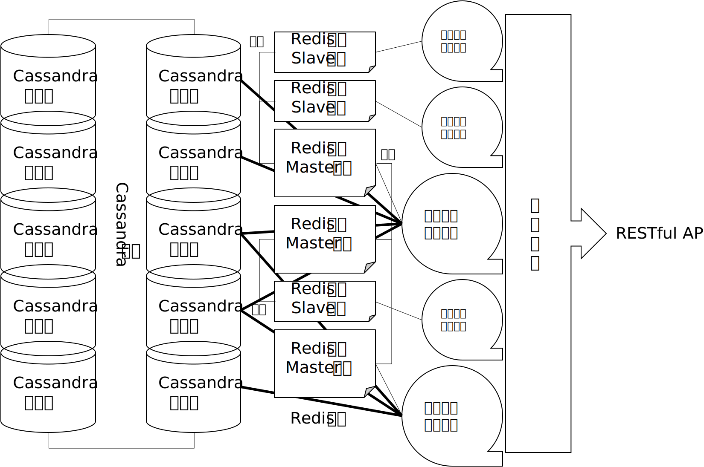

# UserAuth

## Description

* 本项目是无锡市软件测试中心的用户验证服务
* 项目基于Go语言，数据库可以选择使用MySQL或者Cassandra，并使用了Redis作为缓存

## Software Architecture

* 本项目由一系列API组成，分两种模式：
  * 主机模式：拥有数据库和缓存，可读可写，包含用户注册、用户验证、密码修改三个功能
  * 从机模式：仅有缓存，从机缓存与主机缓存同步，只读，仅包含用户验证功能

### 源码组织结构

本项目使用 iris 框架，按照典型的三层Web应用结构进行组织。从外到内对应的文件夹依次是`Controller`、`Service`、`Dao`。

* `Controller`：存放`Web API`处理函数，所有的Web请求皆直接传递到此文件夹的函数中，是对`Controller`层的`Web API`封装；
* `Service`：由`Controller`中各函数调用，处理网站业务逻辑，通过`Dao`层操作数据；
* `Dao`：封装一系列数据操作，向`Service`层隐藏数据库和缓存架构。

`Dao`层中的每个部件都只负责一种数据操作，例如向数据库中插入的部件就只负责数据库和缓存的插入而不关心用户名冲突验证，用户名冲突验证由`Service`层的新建用户的部件负责完成。

`Service`层的新建用户函数中不要直接调用写数据库和缓存的函数，而要调用`Dao`中封装好的写库函数。

项目提供了预置的Docker封装方案(Dockerfile文件)，可直接打包为容器化的微服务

## Installation

### 准备

1. 安装并运行MySQL+Redis或Cassandra+Redis
2. 用Dao文件夹下的.sql文件建好MySQL数据库或者用.cql文件建好Canssandra数据库
3. 在配置文件中写上Redis和数据库的地址(详见配置文件说明)

### 使用Docker启动

#### 编译(可选步骤)

（项目根目录下已提供了一个用下面👇这条指令编译好的可执行文件，执行此步只会覆盖已有文件，因此可以省略）

（👇这个指令编译是生成Alpine平台的可执行文件，如果要在其他平台编译请自行解决）

```shell
docker run -it --rm -v "$(pwd):/app" yindaheng98/go-iris go build -v -o /app/UserAuth
```

1. 在项目根目录运行上面👆的指令
2. 编译完成后会在项目根目录下生成可执行文件UserAuth

#### 打包运行

注：配置文件必须和可执行文件在同一目录下

* 用项目根目录下的Dockerfile👇打包成容器运行

```sh
docker build .
docker run -p 8080:8080 [刚才build的镜像]
```

* 还可以再挂载配置文件运行

```sh
docker run -v "$(pwd)/Config:/Config" -p 8080:8080 [刚才build的镜像]
```

### 不使用docker启动

1. 先把go装好
2. 装iris和redigo👇
```shell
go get github.com/kataras/iris
go get github.com/garyburd/redigo/redis
```
3. 装MySQL或者Canssandra的go连接器👇
```shell
go get github.com/go-sql-driver/mysql # MySQL驱动
go get github.com/gocql/gocql # Cassandra连接器
```
4. `go build`

## Instructions

### 运行模式

#### 主机模式

该模式要求在配置文件中指定数据库和缓存的地址，且要求缓存必须可读写。在该模式下的应用具有全部的读写功能，可以进行注册、修改、验证操作。

#### 从机模式

该模式只要求在配置文件中指定缓存的地址，且只要求缓存可读。在该模式下的应用只具有读取缓存的功能，只能进行基于缓存的验证操作。

由于该模式下无法进行缓存的写入，因此在缓存中放入数据无法由应用进行。与此模式应用相连的缓存必须是以下三种情况之一：

* 通过`slaveof`指令与某个主机模式应用的缓存同步
* 通过`meet`指令与某个主机模式的缓存共享
* 是至少一个主机模式的缓存

### 可选架构

#### 单主机架构


单主机模式就是通常的单数据库+单缓存模式。如果对分布式数据库没有要求可以使用此模式。此模式下的数据库一般用MySQL（数据量不大的时候SQL相比Canssandra有性能优势）。

1. 在配置文件中`DatabaseConfig.yaml`和`CacheConfig.yaml`中写上Redis和数据库的地址，在配置文件`SlaveConfig.yaml`中配置主机模式(详见配置文件说明)
2. 按照上一节的说明启动一台主机即可

#### 一主多从架构



启动一个主机存数据和缓存，再额外添加多个从机专存缓存。当系统只有一个数据库，单读操作负载较多时可以使用此模式，以多个缓存从机分担读操作的负荷，主机只进行写操作和同步缓存。

每个从机都有与一个Redis缓存相连，从机和主机间的Redis缓存通过`slaveof`指令进行同步。主从Redis数据库之间的连接需要其他安全手段保护。

1. 要求先以主机模式部署启动好一个应用，并且让要部署从机的地方能连上Redis
2. 在配置文件`CacheConfig.yaml`中写上从机自己的Redis数据库的地址，在配置文件`SlaveConfig.yaml`中写上主机的数据库地址并配置从机模式(详见配置文件说明)
3. 按照上一节的说明启动

#### 多主机架构



Cassandra数据库集群有两个非常棒的特性：

* 集群中所有主机都是平等的
* 任一主机都可以访问到全网的数据

当使用Cassandra作为数据库时，可以利用Cassandra数据库这两个特性建立多主机的分布式系统，只需要多运行几个Cassandra数据库并把他们相连，然后再以主机模式运行本应用的多个副本即可。

#### 多主多从架构



多主多从模式就是运行多个一主多从模式副本。

### 接口说明

#### 主机模式POST格式

1. /register：用户注册
   * ID：要注册的用户名
   * PASS：密码
2. /verify：用户验证
   * ID：要验证的用户名
   * PASS：要验证的密码
3. /update：修改密码
   * ID：要修改的用户名
   * PASS：原始密码
   * newPASS：新密码

#### 从机模式POST格式

1. /ping：用于检查从属服务器是否在线
   * 无参数
2. /verify：用户验证同主服务

#### 主机模式返回值

所有的返回值均为JSON格式：`{"ok":true|false,"message":"返回信息"}`

1. /register：
   * 用户注册信息成功写入数据库：`ok`为`true`，`message`为空
   * 用户注册信息写入失败：`ok`为`false`，`message`为注册失败原因（“用户名已存在”或错误信息）
2. /verify：用户验证
   * 数据库中可以查找到用户名和密码对应记录：`ok`为`true`，`message`为空
   * 否则：`ok`为`false`，`message`为“用户名或密码错误”或错误信息
3. /update：修改密码
   * 用户密码信息成功修改：`ok`为`true`，`message`为空
   * 否则：`ok`为`false`，`message`为“用户名或密码错误”或错误信息

#### 从机模式返回值

1. /ping：
   * 在线且请求来自主服务器：返回PONG
   * 其他情况无返回
2. /verify：用户验证同主服务
